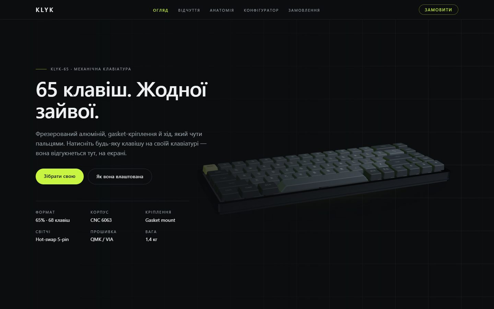
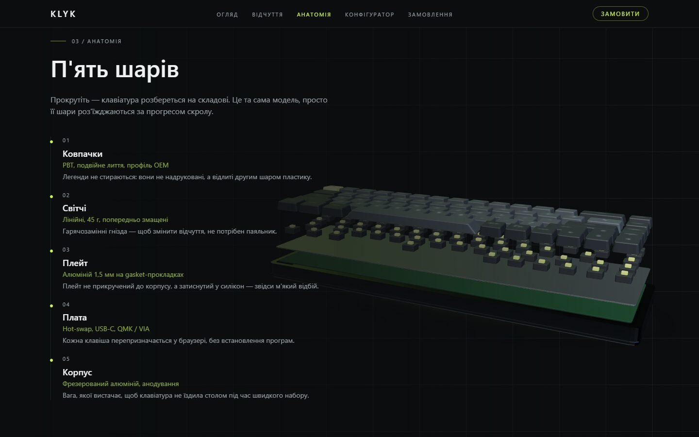
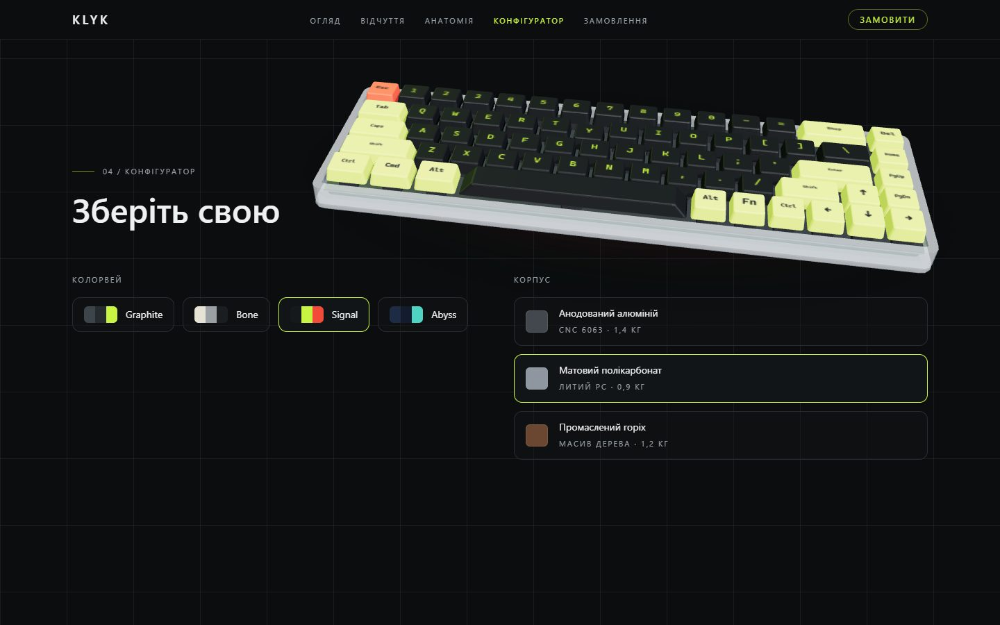
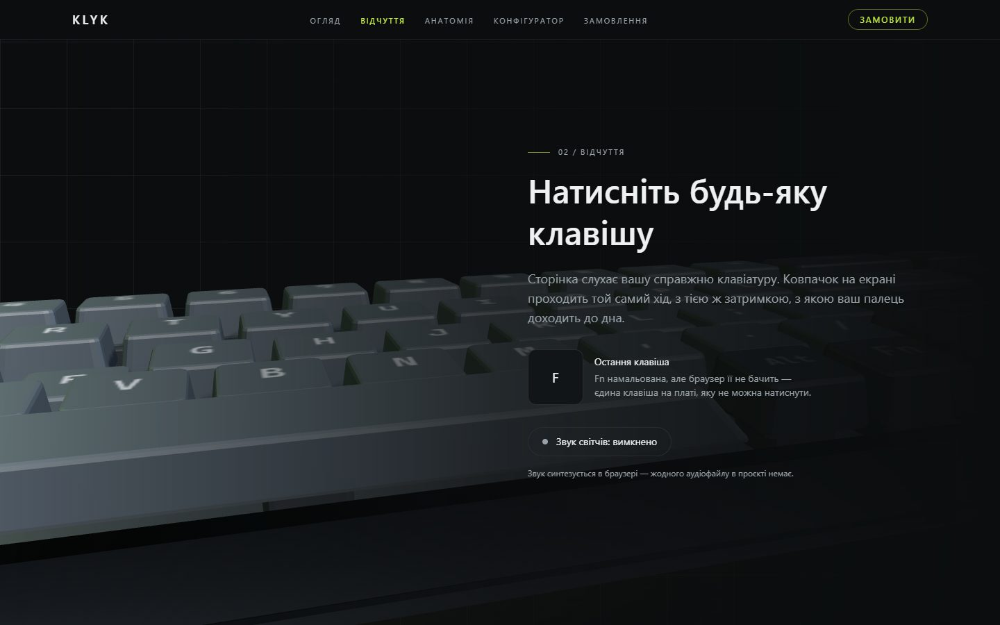
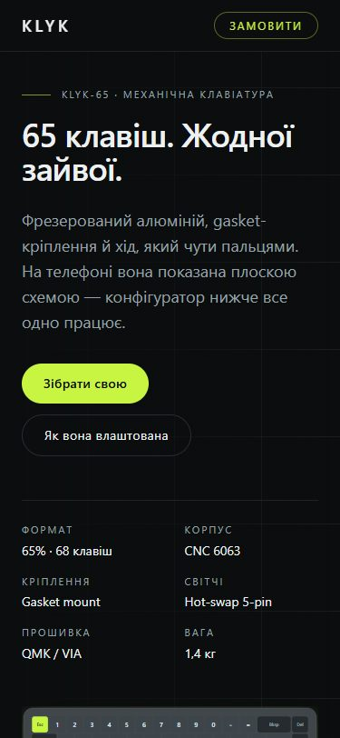
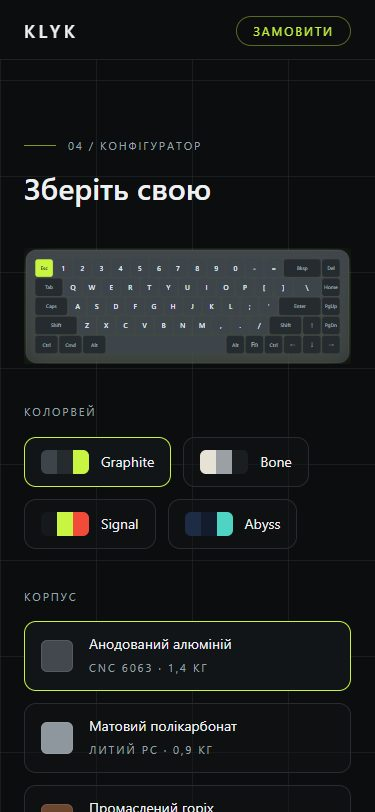

# KLYK-65 — an interactive 3D keyboard landing page

A scroll-driven WebGL landing page for a fictional mechanical keyboard, built as a portfolio project.

**Next.js 16 · React 19 · TypeScript · Tailwind CSS v4 · three.js · React Three Fiber · Zustand**

> KLYK is a concept — the brand does not exist and the keyboard cannot be ordered.
> There is no 3D model, texture, image or audio file anywhere in the repository:
> the case, the keycaps, their legends, the studio lighting and the switch clicks
> are all generated in the browser from ~200 lines of layout data and geometry code.



| Anatomy — the board comes apart on scroll | Configurator |
| --- | --- |
|  |  |

| Feel — press a real key | Mobile (flat board) | Mobile configurator |
| --- | --- | --- |
|  |  |  |

## What it does

- **One scene, five camera stops.** The page is five full-screen sections; each one is a camera keyframe. Scrolling eases the camera, the explode amount and the canvas opacity between them.
- **The board reacts to your actual keyboard.** `keydown` / `keyup` are matched against the layout table by `event.code`, and the matching cap travels 3.5 mm on a spring. Nothing is `preventDefault`ed — Space and the arrows still scroll the page, because taking that away would break keyboard navigation for the sake of a demo.
- **Exploded view.** Caps, switches, plate, PCB and case separate as you scroll through the Anatomy section — the same meshes, lifted by the timeline, not a second scene.
- **Configurator.** Four colourways and three case materials, applied to instance colours and material parameters. The swatches and the 3D board read from one table, so a swatch can never show a colour the cap does not have.
- **Switch sound, synthesised.** A filtered noise burst plus a decaying thump through the Web Audio API — off by default, and the audio context is created only after the visitor turns it on.
- **A flat board for everything else.** Phones and browsers without WebGL2 get the same keyboard drawn as SVG from the same layout table — server-rendered, so crawlers and no-JavaScript visitors see the whole keyboard too. The configurator keeps working there.

## How the board is built

Everything hangs off one table in [`src/three/keyboard-layout.ts`](src/three/keyboard-layout.ts): 68 keys with a `KeyboardEvent.code`, a legend, a width in units and a role. From it come:

- **Geometry** — every part is an extruded rounded rectangle ([`keycap-geometry.ts`](src/three/keycap-geometry.ts)). Caps are tapered and chamfered; the case walls are one extrusion with a hole in it, so the exploded view does not give away four boxes pretending to be a shell.
- **Draw calls** — caps are grouped by width into one `InstancedMesh` each ([`keycap-groups.ts`](src/three/keycap-groups.ts)). A single mesh would have to scale the spacebar 6.25× on X and stretch its corner radius into an ellipse; seven meshes keep every corner identical.
- **Legends** — drawn at runtime into one canvas atlas, rendered as a single instanced quad with a small shader that offsets UVs per instance ([`legend-atlas.ts`](src/three/legend-atlas.ts)). Glyphs are white and tinted per instance, so changing colourway costs an attribute update, not a texture rebuild — and the project ships no font file for the 3D layer.
- **Press state** — one `Float32Array` indexed exactly like the layout table. A keypress is an array write; React never re-renders for it.
- **Lighting** — the environment map is prefiltered in the browser from four emissive panels ([`Studio.tsx`](src/components/scene/Studio.tsx)). Using the usual environment helper would have pulled `RGBELoader`, `EXRLoader` and a gain-map decoder into the bundle for HDRI files this page never loads.
- **The camera timeline** is pure functions over a 0..1 progress ([`timeline.ts`](src/three/timeline.ts)), anchored to the sections' real offsets — so a section taller than the viewport does not drag every earlier keyframe out of step. It is unit tested; the scene only damps towards whatever it returns.

## Performance

Lighthouse against a local production build (`next start`). Scores move ±2 between runs.

| | Performance | Accessibility | Best Practices | SEO |
| --- | :---: | :---: | :---: | :---: |
| Mobile | 93 | 100 | 100 | 100 |
| Desktop | 74 | 100 | 100 | 100 |

Mobile scores **higher than desktop**, which is the whole point of the fallback: phones never download or evaluate three.js at all. On desktop, LCP is 0.6 s and CLS is 0 — the cost is total blocking time (~0.7 s), and essentially all of it is evaluating the 3D engine. That is the honest price of the genre; what this project does about it is:

- WebGL is never started below 768 px or without WebGL2 — the SVG board takes over.
- The 3D bundle is a dynamic import that mounts on an idle main thread, so it never competes with hydration.
- Device pixel ratio is capped at 1.5, the contact shadow is a gradient quad rather than a per-frame shadow pass, and the environment map is baked once.
- `prefers-reduced-motion` stops the camera interpolating, the board swaying and the idle demo typing; the camera then only changes when the section does.

## Running it

```bash
npm install
npm run dev          # http://localhost:3000
```

| Script | What it does |
| --- | --- |
| `npm run lint` / `npm run typecheck` | ESLint (incl. the React Compiler rules) and `tsc --noEmit` |
| `npm test` | Vitest — layout, timeline, geometry and atlas maths |
| `npm run test:e2e` | Playwright — content, anchors, and the no-WebGL fallback |
| `node scripts/capture.mjs [dir] [url]` | Drives the built site through local Chrome: a frame counter, a keypress, a colourway change, and the screenshots in this README |

`scripts/capture.mjs` exists because embedded preview panes do not composite WebGL frames — a real browser is the only way to see whether the scene actually runs.

## Deliberately not here

- **No second language.** The other two landing pages in this portfolio ship Ukrainian and English; here all copy sits in [`src/content/board.ts`](src/content/board.ts) so adding a locale is a dictionary split, but the point of this project is the scene, not the routing.
- **No checkout.** The order card says plainly that the product is a concept; a working-looking checkout for a brand that does not exist would be a lie dressed up as a flourish.
